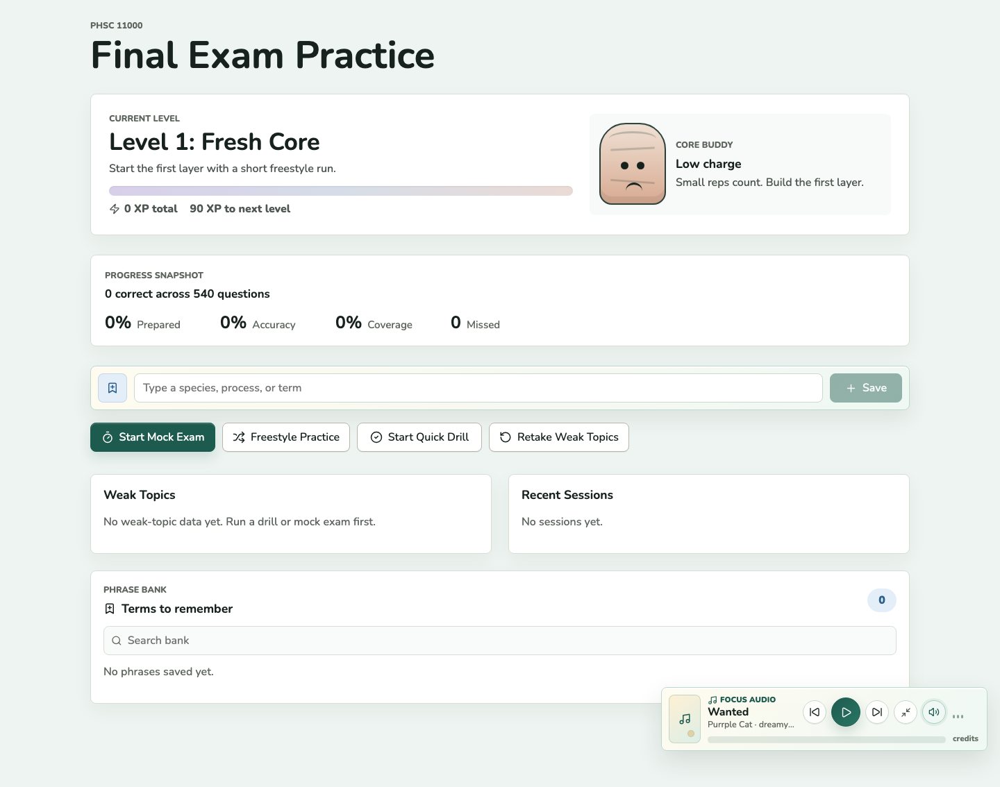
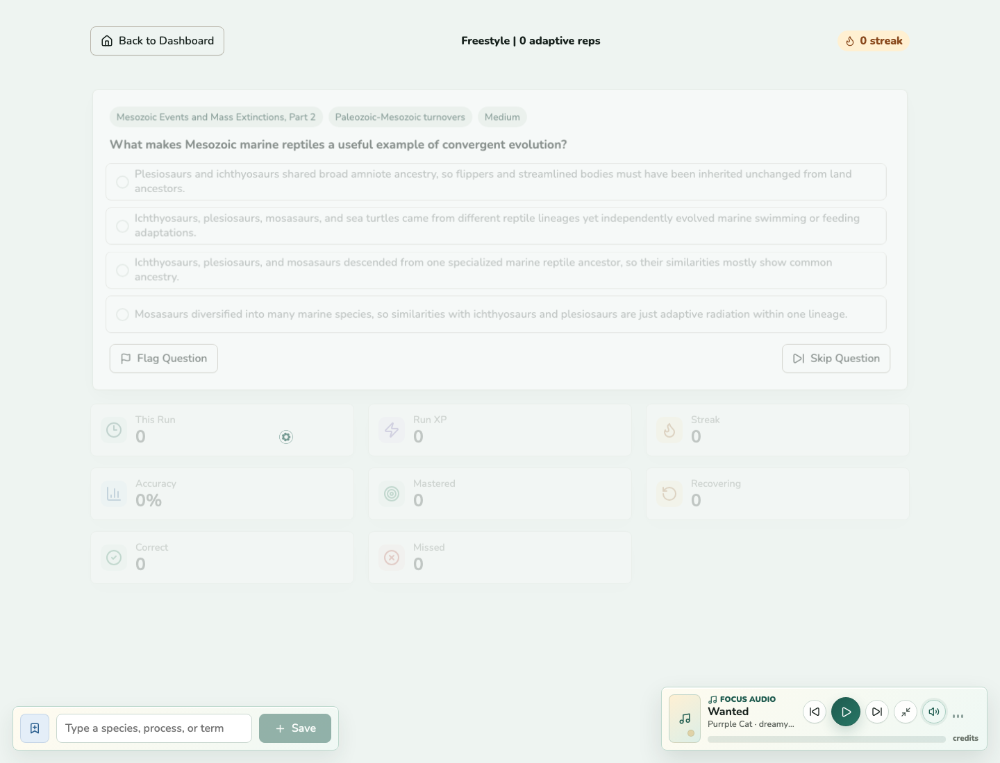
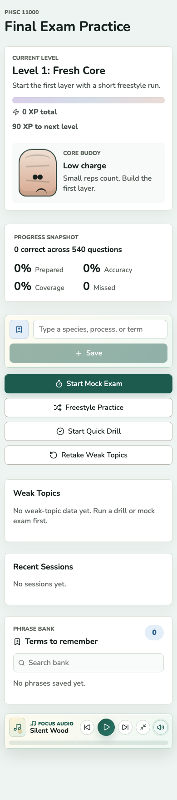

# PHSC 11000 Study Platform

[](https://github.com/aflekkas/phsc-11000-study-platform/actions/workflows/publish.yml)

A React/Vite study platform for PHSC 11000, Environmental History of the Earth. It turns the course arc into an interactive dashboard, adaptive practice, mock exams, weak-topic review, and a persistent phrase bank.

Live app: https://aflekkas.github.io/phsc-11000-study-platform/

If this project helps you study, build a course-review tool, or think about Earth history more clearly, star the repo so other people can find it later.

## Screenshots







## What It Includes

- 27 lecture modules covering present-day Earth controls, inference tools, major biological transitions, mass extinctions, and human impacts.
- 540 multiple-choice questions with shuffled answers, explanations, difficulty labels, and lecture metadata.
- Freestyle adaptive practice that emphasizes missed and fresh material.
- Mock exams, quick drills, weak-topic retakes, progress tracking, XP, streaks, and local persistence.
- A phrase bank for saving useful terms and explanations while reviewing.
- Optional focus audio with source links and attribution.

## Run It Locally

```sh
pnpm install
pnpm dev
```

Quality checks:

```sh
pnpm validate:questions
pnpm build
```

Screenshot refresh:

```sh
pnpm dev
pnpm screenshots
```

## Course Content Notice

This public repo intentionally excludes raw course PDFs and other local-only source files. The app publishes study notes, structured question data, and software built from course review work, not the original lecture decks.

The app is for learning and review. It is not a substitute for the course materials, and it should not be used to submit lab, quiz, or term-paper work.

## Music Credits

Focus audio metadata and source links live in [docs/music-attributions.md](docs/music-attributions.md). Tracks are credited in the in-app player as well.
